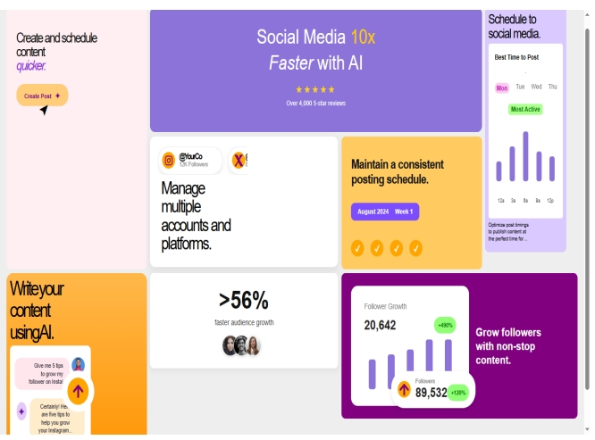

# psychic-tribble
gridfolio
# 🚀 Responsive Landing Page using CSS Grid (psychic-tribble)

A modern **responsive landing page** built with **HTML5** and **CSS Grid**, showcasing a clean, adaptive layout for a social media management platform. The design features AI-powered content creation, post scheduling, multi-account management, growth tracking, and smooth responsiveness.

---

## 🌐 Live Demo
👉 [View Demo on GitHub Pages](https://Vivianbks.github.io/psychic-tribble/)  
*(Replace with your actual link if different)*

---

## 📸 Screenshot
  
*(Make sure this file name matches the uploaded image)*

---

## ✨ Features
- Fully **responsive** using CSS Grid & Flexbox  
- AI chat simulation for interactive content tips  
- **Post scheduler** highlighting optimal posting times  
- **Growth tracking** with charts and statistics  
- Clean, modern UI with accessible typography and soft color scheme  

---

## 🛠️ Technologies Used
- **HTML5**  
- **CSS3** (Grid & Flexbox)  

---

## ⚙️ How to Use
1. Clone the repository:  
   ```bash
   git clone https://github.com/Vivianbks/psychic-tribble.git
